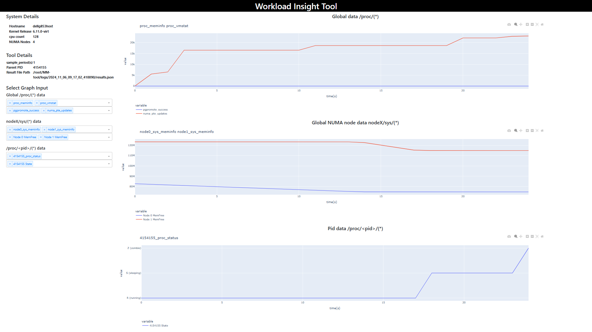
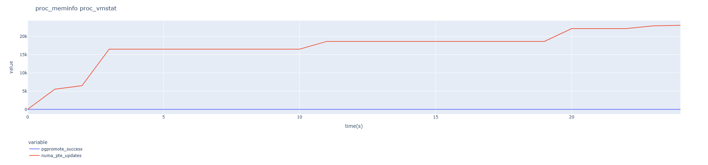
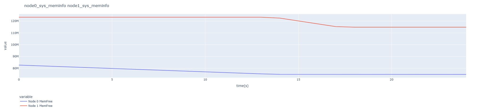
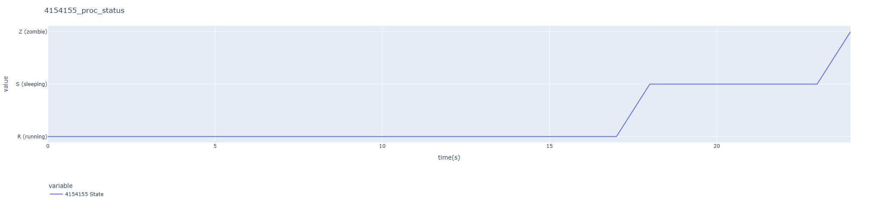
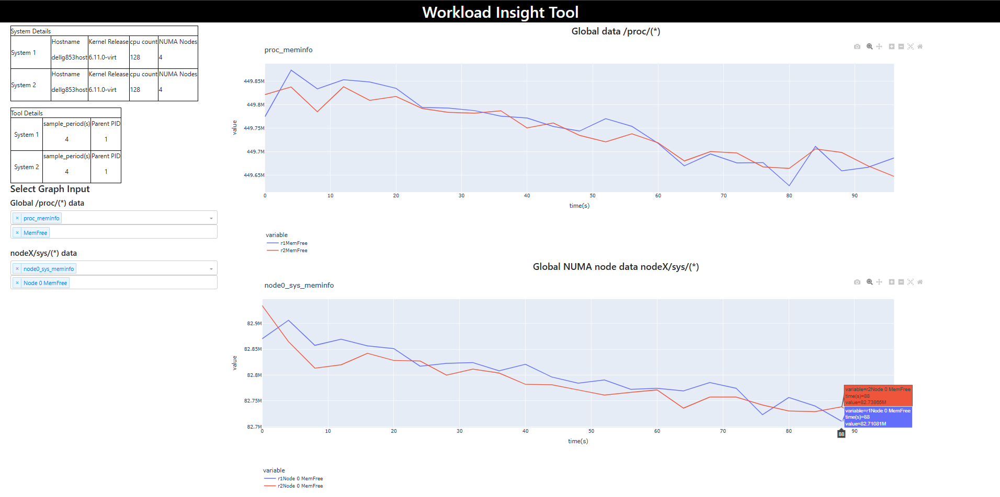

### Contents

- [Workload Insight Tool](#workload-insight-tool)
- [Highlights of syswit](#highlights-of-syswit)
- [How to install and run](#how-to-install-and-run)
- [Requirements](#requirements)
- [Help](#help)
- [Collector](#collector)
- [Analyzer](#analyzer)
- [Comparator](#comparator)
- [Example](#example)
- [Overhead of Collector](#overhead-of-collector)
- [Input Collector Config Customization](#input-collector-config-customization)

## Workload Insight Tool

Workload Insight Tool (syswit) is a tool to analyze workloads on Linux.
It collects global and process related system stats exposed by the kernel
(via procfs and sysfs files) in a time-series manner using `collector`.
Collected data can be analyzed using `analyzer`. Data from multiple runs
can be compared using `comparator`.

## Highlights of syswit
  - Workload analysis
  - Run time capture of global and process related data in time-series manner
  - Data collected in standard format
  - Light-weight
  - Less disk consumption
  - Minimal interference to workload
  - Consolidated graphical view for analysis
  - Comparative visualization of multiple runs

## How to install and run
```bash
pip install .
```
Note: If facing `externally-managed-environment` error, Use a python virtual environment.

## Requirements
```bash
python3 -m pip install -r requirements.txt
```

## Help
```bash
$ syswit -h

usage: syswit [-h] {collect,analyze,compare} ...

syswit

positional arguments:
  {collect,analyze,compare}
                        Components of syswit
    collect             E.g., syswit collect -p 234 -n 10 -s 1
    analyze             E.g., syswit analyze -f '/logs/results.json'
    compare             E.g., syswit compare -f '/logs/results1.json, /logs/results2.json'

  options:
    -h, --help            show this help message and exit

$ syswit collect <args>
$ syswit analyze <args>
$ syswit compare <args>
```

## Collector
This module collects global and process related system stats in a
time-series manner for a workload.

```bash
$ syswit collect -h
  usage: syswit collect [-h] [-c COLLECTOR_INPUT_CONFIG] [-p PID] [-w WORKLOAD]
                        [-C] [-T] [-K] [-n NR_SAMPLES] [-d DELAY_TIME]
                        [-s SAMPLE_PERIOD] [-o OUTPUT_FILE_NAME]
                        [-j CPU_AFFINITY] [-m NODE_AFFINITY] [-f FLUSH_LIMIT]
                        [-L] [-l LOG_DIR] [-a] [-R]

  options:
    -h, --help            show this help message and exit
    -c COLLECTOR_INPUT_CONFIG, --collector-input-config COLLECTOR_INPUT_CONFIG
                          Path to the collector input config
    -p PID, --pid PID     PID of process to be monitored
    -w WORKLOAD, --workload WORKLOAD
                          Command/Workload to run
    -C, --ignore-children
                          Collection will be done for parent process only but not for children processes
    -T, --ignore-threads  Collection will be done for parent and children processes but not for threads
    -K, --keep-workload-alive
                          Keep workload alive when collection ends
    -n NR_SAMPLES, --nr-samples NR_SAMPLES
                          No. of samples to be collected(Default:10)
    -d DELAY_TIME, --delay-time DELAY_TIME
                          Start monitoring after DELAY_TIME(s)
    -s SAMPLE_PERIOD, --sample-period SAMPLE_PERIOD
                          Time period between successive samples(s)(Default:5)
    -o OUTPUT_FILE_NAME, --output-file-name OUTPUT_FILE_NAME
                          Output file name
    -j CPU_AFFINITY, --cpu-affinity CPU_AFFINITY
                          Bind the tool to specified CPUs. E.g., '0:2,6' -> '[0,1,2,6]'
    -m NODE_AFFINITY, --node-affinity NODE_AFFINITY
                          Bind the tool to specified NUMA node. E.g., '0,1'
    -f FLUSH_LIMIT, --flush-limit FLUSH_LIMIT
                          Flushing intermediate results to storage if collected data exceeds this FLUSH_LIMIT in bytes, Default: 13545880
    -L, --ignore-workload-logs
                          Don't capture workload output. By default it is captured in workload.output
    -l LOG_DIR, --log-dir LOG_DIR
                          Results path
    -a, --csv-result      Get results in CSV format
    -R, --ignore-offset   Don't offset the metric values, Default: False
```

Results are populated at `./logs/\<timestamp\>/results.json` format by default.

By default, `collector` collects all the metrics specified in default input yaml.
For any customization refer to [Input Collector Config Customization](#input-collector-config-customization).

Collection can be done for global data and per-process data. Global data are 
files from /proc/ and /sys/devices/system/node/node*/, Per-process data are 
files from /proc/\<pid\>/.

Using `PID` or `WORKLOAD` args refers to collecting per-process data.

`NR_SAMPLES` refers to number of samples to be collected. If collecting in
global data collection mode, the default `NR_SAMPLES` is 10.

If global + per-process collection mode is being used, by default the collection runs until
parent process is alive. However if `NR_SAMPLES` is specified, it abides to the
`NR_SAMPLES` args input.

Affinity of tool can be set using specifying specifc CPU or NUMA node using
`CPU_AFFINITY` or `NODE_AFFINITY`. This can be used to reduce the tool's interference with the workload. Note that this tool doesn't manage the CPU or node affinity of the workload itself.

To reduce tool's memory footprint, intermediate results are flused to the permanent storage.
The flush threshold can be dynamically changed as per needs using `FLUSH_LIMIT` in bytes.

## Analyzer
This module is used to view/analyze results collected by syswit collector.
```bash
$ syswit analyze -h
  usage: syswit analyze [-h] [-f FILE]

  options:
    -h, --help            show this help message and exit
    -f FILE, --file FILE  Path to results(json) file

```
Analyzer will launch a graphical viewer through a web-server.

## Comparator
This module is used to view/compare multiple results collected by
syswit collector.


```bash
$ syswit compare -h
  usage: syswit compare [-h] [-f FILES]

  options:
    -h, --help            show this help message and exit
    -f FILES, --files FILES
                          Path to results(json) of runs for comparison separated by `,`
```
Comparator will launch a graphical viewer through a web-server.

It appends 0 or "NA" to samples if number of samples are different
in different files up to maximum number of samples for
properly plotting graphs.

Comparator can only compare results of different runs with same sample period.

## Example
To collect data from a graph500 run with NR_SAMPLES=25 and SAMPLE_PERIOD=1,
run the following:

```bash
$ syswit collect -w "./graph500.sh" -s 1 -n 25
    Tool Defined to run on specific cpus: [0, 1, 2, 3, 4, 5, 6, 7, 8, 9, 10]
    Hugepages- size: ['1048576kB', '2048kB']  files:  ['nr_hugepages', 'surplus_hugepages', 'free_hugepages']
    Directory Created: /path/to/workload-insight-tool/logs/2024_11_06_09_17_02_410090
    Command: ./graph500.sh > /path/to/workload-insight-tool/logs/2024_11_06_09_17_02_410090/workload.output
    Parent PID: 4154155
    Delay Time: 0
    Sample Period: 1.0
    nr_samples: 25
    Keep Workload alive: False
    No. of NUMA Nodes: 4
    Config File Path: /path/to/localenv/v2env/lib/python3.10/site-packages/syswit/collector_configs/input.yaml
    Logging metrics:
    {'proc_meminfo': ['all'], 'proc_vmstat': ['all'], 'proc_stat': ['all'], 'proc_iomem': ['all'], 'proc_cpuinfo': ['all'],
        'sys_meminfo': ['all'], 'sys_numastat': ['all'], 'sys_vmstat': ['all'], 'p_proc_stat': ['all'], 'p_proc_statm': ['all'],
        'p_proc_status': ['all'], 'p_proc_sched': ['all']}
    Collecting...
    * * * * * * * * * * * * * * * * * * * * * * * * * Saving logs...

    Killed Process 4154155

    Aggregating Start
    Results at: /path/to/workload-insight-tool/logs/2024_11_06_09_17_02_410090/results.json
    Workload Output at: /path/to/workload-insight-tool/logs/2024_11_06_09_17_02_410090/workload.output
```

To Analyze results run the following:
```bash
  $ syswit analyze -f results.json
    sample_period(s): 1.0
    Parent PID: 4154155
    Result File Path: results.json
    Dash is running on http://localhost:8050/

    * Serving Flask app 'Analyzer'
    * Debug mode: off
```
The graphs can be viewed at http://localhost:8050/. A few sample graphical views from analyzer are shown below:






To compare multiple results use comparator and review results in
graphical manner.

```bash
  $ syswit compare -f "results1.json results2.json"

    file 1: results1.json
    sample_period(s): 1.0
    Parent PID: 136244
    file 2: results2.json
    sample_period(s): 1.0
    Parent PID: 233410
    Dash is running on http://localhost:8050/

    * Serving Flask app 'Comparator'
    * Debug mode: off
```


Such graphs can be used to compare two runs of equal sampling period.


## Overhead of Collector
Overhead comparison on running Hackbench with syswit.

```
Tested on AMD EPYC 7713 64-Core(SMT ON)
Benchmark cmdline: "./perf bench sched messaging -t -p -g 20 -l 1000000"

Baseline vs syswit
Baseline(us)                : 131.53
syswit(1 sec sample period) : 132.80
syswit(5 sec sample period) : 132.42

Modes                                   : Delta
Baseline vs syswit(1 sec sample period) : 1%
Baseline vs syswit(5 sec sample period) : 0.7%
```

## Input Collector Config Customization

A default yaml configuration file has been provided at `workload-insight-tool/syswit/collector_configs/input.yaml`.

How to specify a stat file in the config?
 
  - The files in /proc should be prepended with `proc_`. 
    Eg. /proc/meminfo is specified as proc_meminfo
  - PID specific files in /proc are prepended with `p_proc_`
    Eg. /proc/1234/stat is specified as p_proc_stat
  - Files under `/sys/devices/system/node/node*/` should be preceded with `sys_`
    Eg. /sys/devices/system/node/node*/meminfo is specified as sys_meminfo

For enabling new procfs or sysfs files for collection through tool
edit `./collector_config/input_yaml` and input file_tags following nomenclature
provided.

Supported files for collection are mentioned at `./tool_configs/metric_separator.yaml`
 and will be using the generic parser.
If prompted with file not supported, add details of file at `./tool_configs/metric_separator`
using the same naming convention.

For adding any new source files that needs a special parsing
mechanism, a separate parsing_function/file needs to be written.
